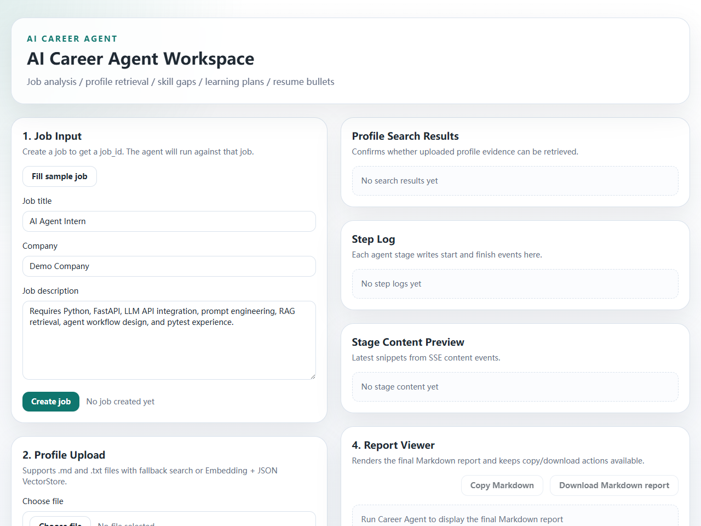
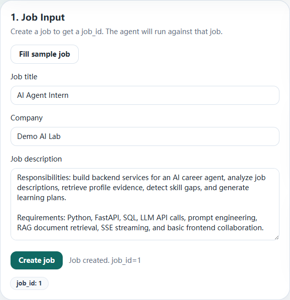
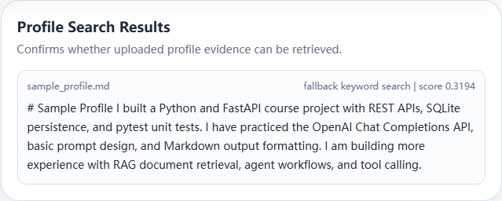
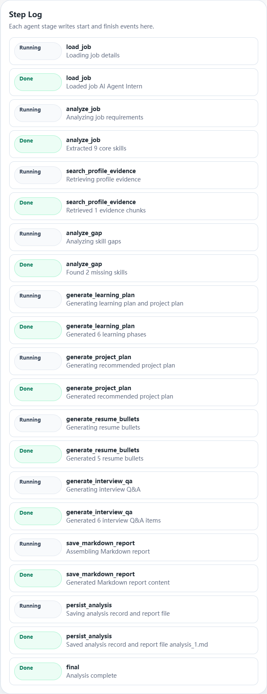
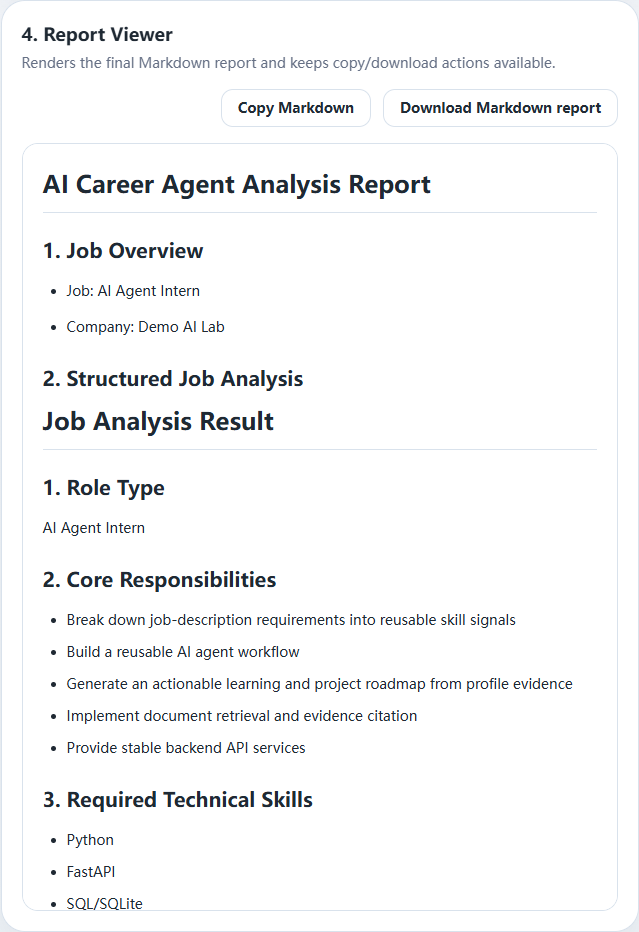
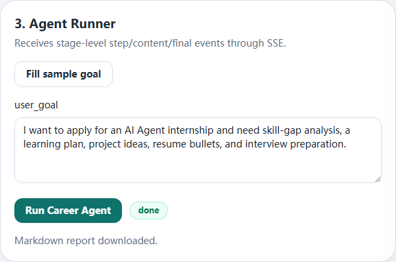
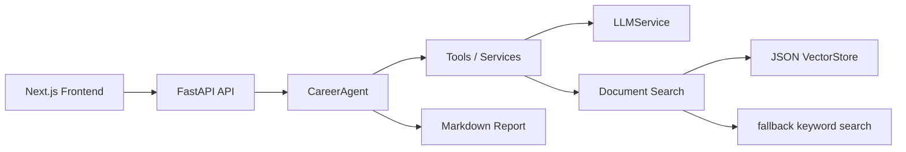

# AI Career Agent

[](https://github.com/xianger013/ai-career-agent/actions/workflows/ci.yml)
[](LICENSE)

AI Career Agent is an open-source full-stack workspace that helps students and job seekers turn a job description and personal profile notes into a structured career plan. It combines FastAPI, Next.js, an agent workflow, RAG-style profile retrieval, SSE streaming, and Markdown report generation.

The project is intentionally useful without paid services: `RAG_MODE=fallback` runs deterministic keyword retrieval for local demos, while `RAG_MODE=vector` supports OpenAI-compatible embeddings with a local JSON VectorStore.

## Screenshots













## Core Features

- Job description creation and structured role analysis.
- Profile upload for `.md` and `.txt` files.
- Local fallback keyword retrieval for zero-key demos.
- OpenAI-compatible embeddings with a JSON VectorStore.
- CareerAgent workflow orchestration with reusable tools.
- Stage-level SSE events for step logs and content previews.
- Markdown report rendering, copy, and download actions.
- Deterministic tests for backend retrieval, agent flow, and fallback behavior.

## Tech Stack

Backend:

- FastAPI
- Pydantic
- SQLAlchemy
- SQLite
- httpx
- pytest

Frontend:

- Next.js
- React
- TypeScript
- Tailwind CSS
- react-markdown
- SSE / EventSource

AI workflow:

- OpenAI-compatible Chat Completions API
- OpenAI-compatible Embeddings API
- Prompt files
- RAG-style retrieval
- Agent workflow and tool calling

## Architecture



## Quick Start

### Backend

On Windows PowerShell, prefer `python -m ...` so the active interpreter is used consistently.

```powershell
cd backend
python -m pip install -r requirements.txt
Copy-Item .env.example .env
python -m uvicorn app.main:app --reload
```

Backend URL:

```text
http://127.0.0.1:8000
```

Health check:

```powershell
curl.exe http://127.0.0.1:8000/health
```

API docs:

```text
http://127.0.0.1:8000/docs
```

### Frontend

```powershell
cd frontend
npm ci
Copy-Item .env.example .env.local
npm run dev
```

Open:

```text
http://localhost:3000
```

## Environment Variables

Backend settings live in `backend/.env.example`.

- `LLM_API_KEY`: LLM API key. The placeholder enables fallback demos.
- `LLM_BASE_URL`: OpenAI-compatible chat completions base URL.
- `LLM_MODEL`: Chat model name.
- `RAG_MODE`: `fallback` or `vector`.
- `EMBEDDING_API_KEY`: Embedding API key, required only for vector mode.
- `EMBEDDING_BASE_URL`: OpenAI-compatible embeddings base URL.
- `EMBEDDING_MODEL`: Embedding model name.
- `VECTOR_STORE_TYPE=json`: current local JSON VectorStore.
- `NEXT_PUBLIC_API_BASE_URL`: frontend backend URL, default `http://127.0.0.1:8000`.

Notes:

- `RAG_MODE=fallback` does not require an embedding key.
- `RAG_MODE=vector` requires an embedding API.
- ChromaDB and FAISS are roadmap targets, not current dependencies.

## Demo Flow

1. Start the backend.
2. Start the frontend.
3. Open `http://localhost:3000`.
4. Click `Fill sample job`.
5. Click `Create job` and confirm the `job_id`.
6. Upload `backend/data/samples/sample_profile.md` or your own `.md` / `.txt` profile.
7. Click `Search profile` to inspect retrieved evidence.
8. Click `Fill sample goal`.
9. Click `Run Career Agent`.
10. Review step logs, content previews, and the final Markdown report.
11. Copy or download the report.

## Tests

Backend:

```powershell
cd backend
python -m pytest
```

Frontend:

```powershell
cd frontend
npm run build
```

Current baseline:

- backend: 15 passed
- frontend: production build passed

## Open Source Status

This is a young public project created and maintained by `xianger013`. Current public metrics are intentionally reported as they are: 1 GitHub star, 0 forks, and no package download metrics. The project is being prepared as a useful OSS reference implementation for job-search agents, career planning workflows, and local-first AI application demos.

Maintainer materials:

- [Contributing guide](CONTRIBUTING.md)
- [Roadmap](docs/roadmap.md)
- [Codex for OSS application notes](docs/codex_for_oss_application.md)
- [Release checklist](docs/release_checklist.md)

## Current Limitations

- SSE is stage-level streaming, not token-level streaming.
- JSON VectorStore is for small demos, not production-scale retrieval.
- Authentication, multi-user isolation, and permissions are not implemented yet.
- Docker, hybrid search, and reranking are roadmap items.

## Documentation

- [Demo guide](docs/demo_guide.md)
- [RAG design](docs/rag_design.md)
- [Backend acceptance notes](docs/backend_mvp_acceptance.md)
- [Technical review](docs/technical_review.md)
- [Project retrospective](docs/project_retrospective.md)
- [Interview Q&A](docs/interview_qa.md)
- [Interview script](docs/interview_script.md)
- [Resume positioning](docs/resume_final.md)
