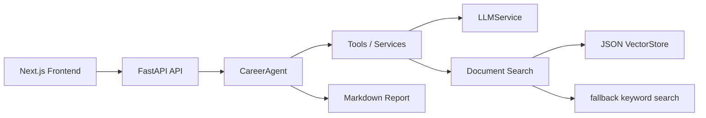

# AI Career Agent

## 1. 项目简介

AI Career Agent 是一个面向大学生和求职者的 AI 求职能力分析与学习规划系统。用户可以输入岗位 JD、上传个人资料，系统通过 LLM、RAG、Agent 工作流和 SSE，生成岗位能力拆解、个人能力差距分析、学习路线、项目建议、简历描述和面试问答。

项目定位是作品集级全栈 AI Agent：默认可用 fallback keyword search 本地演示，也支持配置 OpenAI-compatible Embedding + 本地 JSON VectorStore 进行向量检索。

## 2. 项目截图

请将本地演示截图保存到 `docs/assets/` 下。

- 首页截图：`docs/assets/homepage.png`
- 创建岗位截图：`docs/assets/job-created.png`
- Agent 运行截图：`docs/assets/agent-running.png`
- 报告结果截图：`docs/assets/report-result.png`
- 报告下载截图：`docs/assets/report-download.png`

## 3. 核心功能

- 岗位 JD 创建与分析。
- 个人资料 `.md` / `.txt` 上传。
- fallback keyword search 本地检索。
- OpenAI-compatible Embedding + JSON VectorStore 向量检索。
- CareerAgent 工作流编排。
- SSE 阶段式流式输出。
- Markdown 报告渲染、复制、下载。
- 示例岗位和示例目标一键填充。

## 4. 技术栈

后端：

- FastAPI
- Pydantic
- SQLAlchemy
- SQLite
- httpx
- pytest

前端：

- Next.js
- React
- TypeScript
- Tailwind CSS
- react-markdown
- SSE / EventSource

AI：

- OpenAI-compatible Chat Completions API
- OpenAI-compatible Embeddings API
- Prompt Engineering
- RAG
- Agent Workflow

## 5. 系统架构



## 6. 快速开始

### 后端启动

Windows PowerShell 推荐使用 `python -m uvicorn`。

```powershell
cd backend
python -m pip install -r requirements.txt
Copy-Item .env.example .env
python -m uvicorn app.main:app --reload
```

后端地址：

```text
http://127.0.0.1:8000
```

健康检查：

```powershell
curl.exe http://127.0.0.1:8000/health
```

API 文档：

```text
http://127.0.0.1:8000/docs
```

### 前端启动

```powershell
cd frontend
npm install
Copy-Item .env.example .env.local
npm run dev
```

访问：

```text
http://localhost:3000
```

## 7. 环境变量说明

后端配置见 `backend/.env.example`。

- `LLM_API_KEY`：LLM API Key，占位符可用于 fallback 演示。
- `LLM_BASE_URL`：OpenAI-compatible chat completions base URL。
- `LLM_MODEL`：聊天模型名称。
- `RAG_MODE`：`fallback` 或 `vector`。
- `EMBEDDING_API_KEY`：embedding API Key，仅 vector 模式需要。
- `EMBEDDING_BASE_URL`：OpenAI-compatible embeddings base URL。
- `EMBEDDING_MODEL`：embedding 模型名称。
- `VECTOR_STORE_TYPE=json`：当前版本使用本地 JSON VectorStore。
- `NEXT_PUBLIC_API_BASE_URL`：前端连接后端地址，默认 `http://127.0.0.1:8000`。

说明：

- `RAG_MODE=fallback` 不需要 embedding key。
- `RAG_MODE=vector` 需要 embedding API。
- 当前版本使用 OpenAI-compatible Embedding + 本地 JSON VectorStore，后续可替换为 ChromaDB/FAISS。
- `chroma` / `faiss` 只是未来可选值，当前尚未实际接入。

## 8. 完整演示流程

1. 启动后端。
2. 启动前端。
3. 打开 `http://localhost:3000`。
4. 点击“填充示例岗位”。
5. 点击“创建岗位”，确认页面显示 `job_id`。
6. 上传 `backend/data/samples/sample_profile.md` 或自己的 `my_profile.md`。
7. 点击“检索资料”查看召回片段。
8. 点击“填充示例目标”。
9. 点击“运行 Career Agent”。
10. 查看步骤日志。
11. 查看 Markdown 报告。
12. 点击“下载 Markdown 报告”。

## 9. 测试

后端：

```powershell
cd backend
python -m pytest
```

前端：

```powershell
cd frontend
npm run build
```

当前结果：

- backend：14 passed
- frontend：build passed

## 10. 当前限制

- 当前 SSE 是阶段式流式，不是 token 级流式。
- 当前向量存储是 JSON VectorStore，不适合大规模生产。
- 当前没有登录、多用户隔离和权限系统。
- 当前没有 Docker。
- 当前没有 reranker 和 hybrid search。
- ChromaDB/FAISS 尚未实际接入，只预留替换方向。

## 11. 后续路线

- Hybrid Search：keyword + vector。
- ChromaDB/FAISS。
- Reranker。
- PDF / DOCX 解析。
- Docker 部署。
- 多用户数据隔离。
- 更完善的评测集。

## 12. 简历包装

简短表述：

> AI Career Agent 是一个面向大学生求职的 AI Agent 工作台，基于 FastAPI、Next.js、LLM API、RAG 和 SSE，实现岗位 JD 分析、个人资料检索、能力差距分析、学习路线生成、项目建议、简历描述和面试问答生成。

详细简历版本见 [docs/resume_final.md](docs/resume_final.md)。

## 文档索引

- [演示指南](docs/demo_guide.md)
- [RAG 设计](docs/rag_design.md)
- [简历最终表述](docs/resume_final.md)
- [面试讲解稿](docs/interview_script.md)
- [技术问答](docs/interview_qa.md)
- [项目复盘](docs/project_retrospective.md)
- [发布前检查清单](docs/release_checklist.md)

